## Springboot 버전을 3.X로 업그레이드한다.
### 버전을 변경한다.
build.gradle
```
plugins {
    id 'java'
    id 'org.springframework.boot' version '3.2.0'
    id 'io.spring.dependency-management' version "1.1.4"
    id "org.asciidoctor.jvm.convert" version "3.3.2"
    id "com.ewerk.gradle.plugins.querydsl" version "1.0.10"
}

java {
    sourceCompatibility = '17'
}
```

SpringBoot 버전을 3.2로 변경하였다.  
Java 버전을 17으로 변경하였다. (Spring 3 버전은 JDK 17 이상을 사용해야 한다.)

### QueryDSL 5.0.0 버전을 사용한다.
build.gradle
```
    implementation 'com.querydsl:querydsl-jpa:5.0.0:jakarta'
    annotationProcessor "com.querydsl:querydsl-apt:${dependencyManagement.importedProperties['querydsl.version']}:jakarta"
    annotationProcessor "jakarta.annotation:jakarta.annotation-api"
    annotationProcessor "jakarta.persistence:jakarta.persistence-api"
```

- SpringBoot 3.X 버전을 사용하여서 바뀐 세 가지 특징
  - javax -> jakarta
  - QueryDSL 플러그인을 사용하지 X
  - QueryDSL 버전을 명시하지 X

### javax 패키지명을 jakarta로 변경한다.
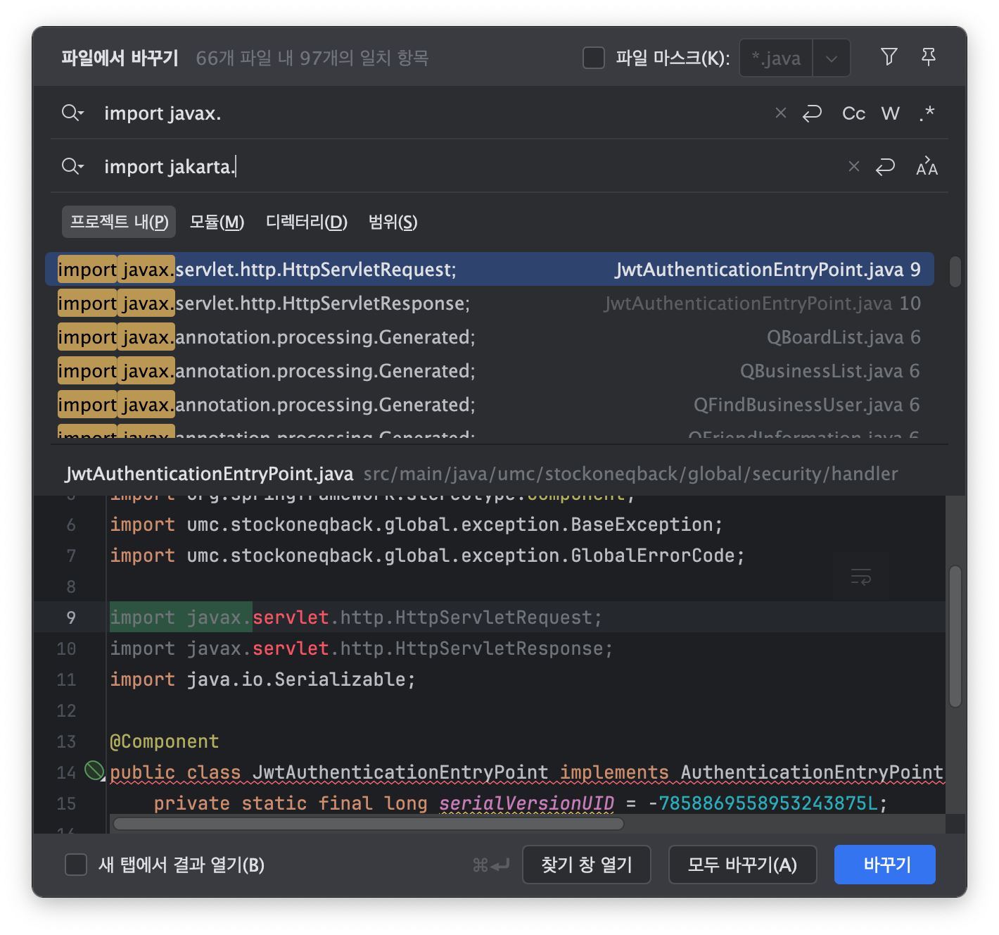

## Trouble Shooting
### 빌드시 QClass가 생성되지 않는 에러가 발생했다.
**Try 1**  
```
    id "com.ewerk.gradle.plugins.querydsl" version "1.0.10"
```
위의 플러그인을 추가했다.
> Gradle 5.0 이상에서는 com.ewerk.gradle.plugins.querydsl을 사용하지 않는다. => 삭제

**Try 2**  
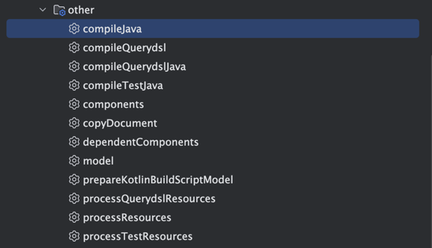  
compileQuerydsl이 생성된 것으로 보아 Querydsl을 인식하는 것 같다.  
> SpringBoot 3.X는 QueryDSL 플러그인을 추가하지 않기 때문에 compileQuerydsl이 생성되지 않는다. compileJava로 간단하게 동작한다.  
> (https://lordofkangs.tistory.com/461)

**Try 3**  
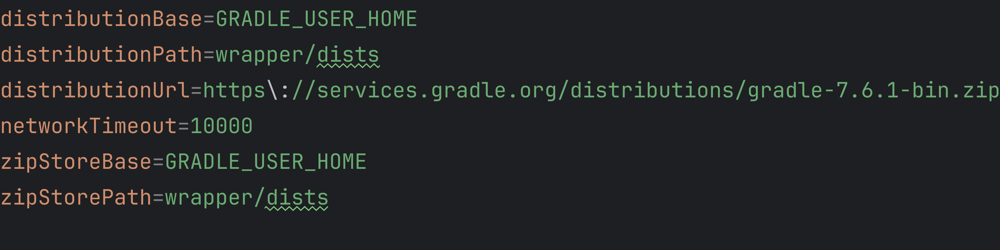  
gradle 버전을 8.X -> 7.X로 변경하여도 해결이 되지 않는다...

**Try 4**  
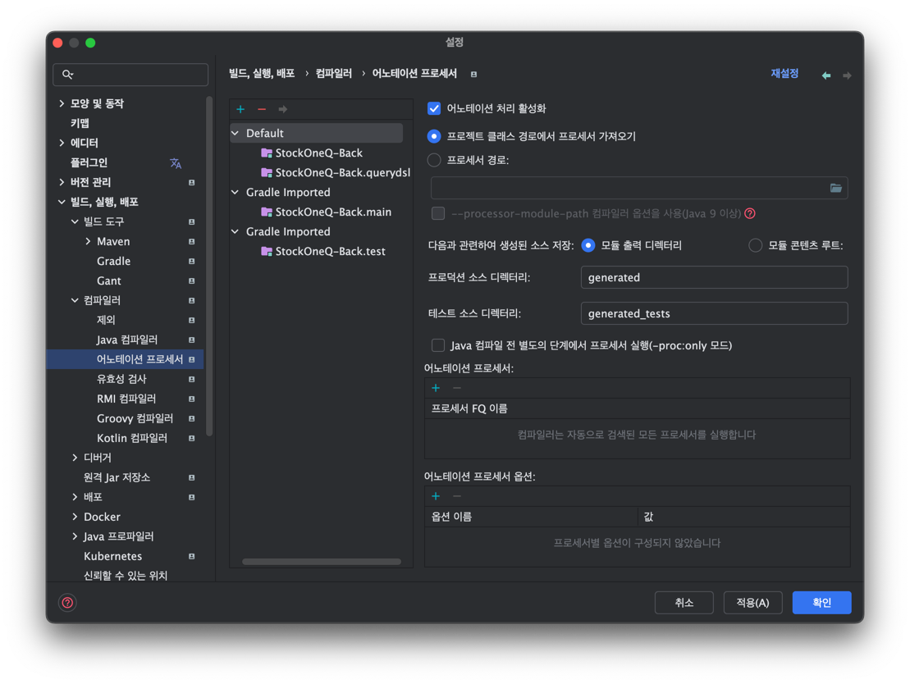  
annotaion processor를 활성화하였는데도 해결이 되지 않는다... (IDE 내에서 Querydsl 관련 코드를 자동으로 생성하게 해주는 중요한 과정이다.)

**Try 5**  
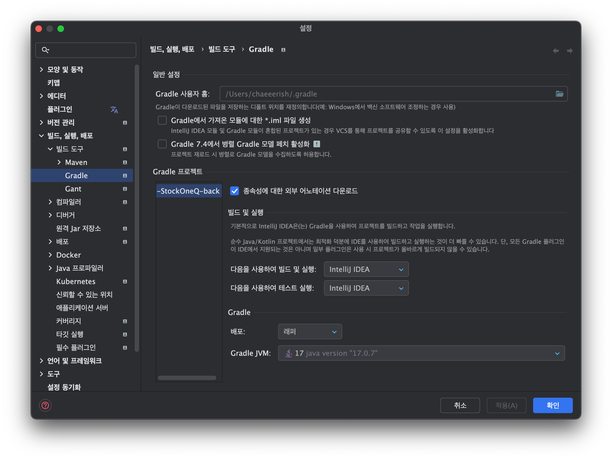  
IntelliJ IDEA 빌드로 변경하여도 안된다...

**Try 6**  
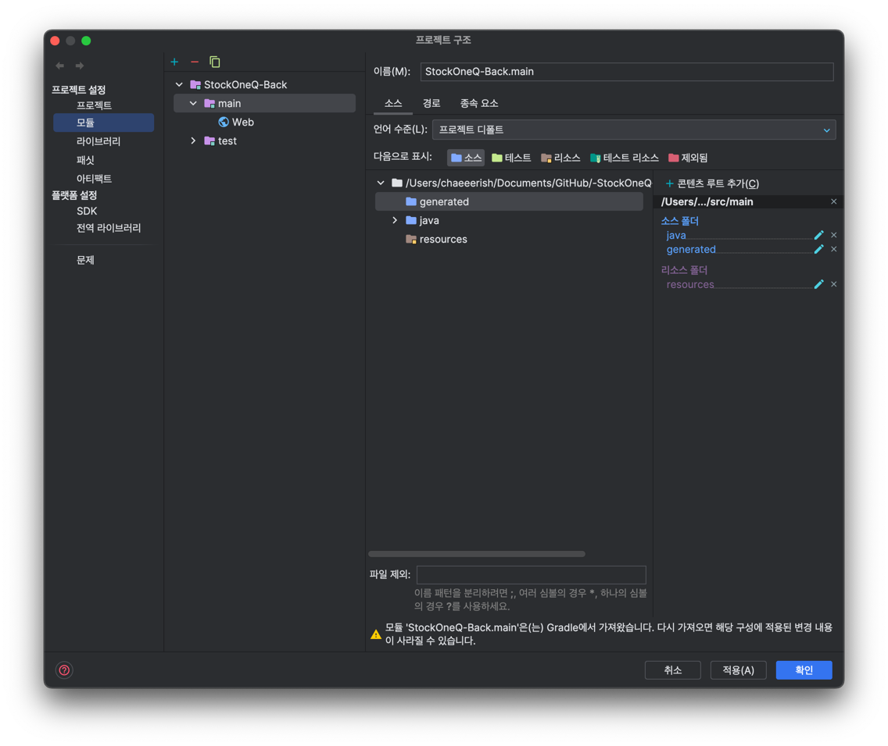  
모듈에서 generated 폴더를 소스로 지정해주어도 안된다...  
> generated 폴더에 Q Class가 있는데 어플리케이션에서 찾지 못할 때 유용한 방법인 것 같다... (https://jong-bae.tistory.com/43)
(https://devkingdom.tistory.com/231)

**Try 7**  

IntelliJ의 버전을 2023으로 바꿔도 안된다... 

**Try 8**
```yml
# As-Is
spring:
  redis:
    port: 6379
  
# To-Be
spring:
  data:
    redis:
      port: 6379
```
SpringBoot 3.X의 application.yml에서 redis의 dept가 수정되었다. (https://techblog.lycorp.co.jp/ko/how-to-migrate-to-spring-boot-3)

**Try 9**
```
./gradlew build
```
위의 명령어로 직접 빌드를 해보니 아래의 에러 로그가 발생했다. 분석해보자.
```
chaeeerish@yangchaelin-ui-MacBookAir -StockOneQ-back % ./gradlew build            

> Task :compileJava FAILED
/Users/chaeeerish/Documents/GitHub/-StockOneQ-back/src/main/java/umc/stockoneqback/friend/infra/query/FriendFindQueryRepositoryImpl.java:8: error: cannot find symbol
import umc.stockoneqback.user.infra.query.dto.QFindManager;
                                             ^
  symbol:   class QFindManager
  location: package umc.stockoneqback.user.infra.query.dto
/Users/chaeeerish/Documents/GitHub/-StockOneQ-back/src/main/java/umc/stockoneqback/friend/infra/query/FriendFindQueryRepositoryImpl.java:12: error: cannot find symbol
import static umc.stockoneqback.friend.domain.QFriend.friend;
                                             ^
  symbol:   class QFriend
  location: package umc.stockoneqback.friend.domain
/Users/chaeeerish/Documents/GitHub/-StockOneQ-back/src/main/java/umc/stockoneqback/friend/infra/query/FriendFindQueryRepositoryImpl.java:12: error: static import only from classes and interfaces
import static umc.stockoneqback.friend.domain.QFriend.friend;
^
/Users/chaeeerish/Documents/GitHub/-StockOneQ-back/src/main/java/umc/stockoneqback/friend/infra/query/FriendFindQueryRepositoryImpl.java:13: error: cannot find symbol
import static umc.stockoneqback.role.domain.store.QStore.store;
                                                 ^
  symbol:   class QStore
  location: package umc.stockoneqback.role.domain.store
/Users/chaeeerish/Documents/GitHub/-StockOneQ-back/src/main/java/umc/stockoneqback/friend/infra/query/FriendFindQueryRepositoryImpl.java:13: error: static import only from classes and interfaces
import static umc.stockoneqback.role.domain.store.QStore.store;
^
/Users/chaeeerish/Documents/GitHub/-StockOneQ-back/src/main/java/umc/stockoneqback/friend/infra/query/FriendFindQueryRepositoryImpl.java:14: error: cannot find symbol
import static umc.stockoneqback.user.domain.QUser.user;
                                           ^
  symbol:   class QUser
  location: package umc.stockoneqback.user.domain
/Users/chaeeerish/Documents/GitHub/-StockOneQ-back/src/main/java/umc/stockoneqback/friend/infra/query/FriendFindQueryRepositoryImpl.java:14: error: static import only from classes and interfaces
import static umc.stockoneqback.user.domain.QUser.user;
^
/Users/chaeeerish/Documents/GitHub/-StockOneQ-back/src/main/java/umc/stockoneqback/friend/infra/query/FriendInformationQueryRepositoryImpl.java:6: error: cannot find symbol
import umc.stockoneqback.friend.domain.QFriend;
                                      ^
  symbol:   class QFriend
  location: package umc.stockoneqback.friend.domain
/Users/chaeeerish/Documents/GitHub/-StockOneQ-back/src/main/java/umc/stockoneqback/friend/infra/query/FriendInformationQueryRepositoryImpl.java:8: error: cannot find symbol
import umc.stockoneqback.friend.infra.query.dto.response.QFriendInformation;
                                                        ^
  symbol:   class QFriendInformation
  location: package umc.stockoneqback.friend.infra.query.dto.response
/Users/chaeeerish/Documents/GitHub/-StockOneQ-back/src/main/java/umc/stockoneqback/friend/infra/query/FriendInformationQueryRepositoryImpl.java:13: error: cannot find symbol
import static umc.stockoneqback.role.domain.store.QStore.store;
                                                 ^
  symbol:   class QStore
  location: package umc.stockoneqback.role.domain.store
/Users/chaeeerish/Documents/GitHub/-StockOneQ-back/src/main/java/umc/stockoneqback/friend/infra/query/FriendInformationQueryRepositoryImpl.java:13: error: static import only from classes and interfaces
import static umc.stockoneqback.role.domain.store.QStore.store;
^
/Users/chaeeerish/Documents/GitHub/-StockOneQ-back/src/main/java/umc/stockoneqback/friend/infra/query/FriendInformationQueryRepositoryImpl.java:14: error: cannot find symbol
import static umc.stockoneqback.user.domain.QUser.user;
                                           ^
  symbol:   class QUser
  location: package umc.stockoneqback.user.domain
/Users/chaeeerish/Documents/GitHub/-StockOneQ-back/src/main/java/umc/stockoneqback/friend/infra/query/FriendInformationQueryRepositoryImpl.java:14: error: static import only from classes and interfaces
import static umc.stockoneqback.user.domain.QUser.user;
^
/Users/chaeeerish/Documents/GitHub/-StockOneQ-back/src/main/java/umc/stockoneqback/friend/infra/query/FriendInformationQueryRepositoryImpl.java:20: error: cannot find symbol
    private static final QFriend friend = new QFriend("friend");
                         ^
  symbol:   class QFriend
  location: class FriendInformationQueryRepositoryImpl
/Users/chaeeerish/Documents/GitHub/-StockOneQ-back/src/main/java/umc/stockoneqback/user/domain/User.java:19: error: package javax.persistence does not exist
import static jakarta.persistence.CascadeType.PERSIST;
                               ^
/Users/chaeeerish/Documents/GitHub/-StockOneQ-back/src/main/java/umc/stockoneqback/user/domain/User.java:19: error: static import only from classes and interfaces
import static jakarta.persistence.CascadeType.PERSIST;
^
/Users/chaeeerish/Documents/GitHub/-StockOneQ-back/src/main/java/umc/stockoneqback/board/domain/Board.java:16: error: package javax.persistence does not exist
import static jakarta.persistence.CascadeType.PERSIST;
                               ^
/Users/chaeeerish/Documents/GitHub/-StockOneQ-back/src/main/java/umc/stockoneqback/board/domain/Board.java:16: error: static import only from classes and interfaces
import static jakarta.persistence.CascadeType.PERSIST;
^
/Users/chaeeerish/Documents/GitHub/-StockOneQ-back/src/main/java/umc/stockoneqback/comment/domain/Comment.java:17: error: package javax.persistence does not exist
import static jakarta.persistence.CascadeType.PERSIST;
                               ^
/Users/chaeeerish/Documents/GitHub/-StockOneQ-back/src/main/java/umc/stockoneqback/comment/domain/Comment.java:17: error: static import only from classes and interfaces
import static jakarta.persistence.CascadeType.PERSIST;
^
/Users/chaeeerish/Documents/GitHub/-StockOneQ-back/src/main/java/umc/stockoneqback/board/infra/query/BoardListQueryRepositoryImpl.java:14: error: cannot find symbol
import umc.stockoneqback.board.infra.query.dto.QBoardList;
                                              ^
  symbol:   class QBoardList
  location: package umc.stockoneqback.board.infra.query.dto
/Users/chaeeerish/Documents/GitHub/-StockOneQ-back/src/main/java/umc/stockoneqback/board/infra/query/BoardListQueryRepositoryImpl.java:19: error: cannot find symbol
import static umc.stockoneqback.board.domain.QBoard.board;
                                            ^
  symbol:   class QBoard
  location: package umc.stockoneqback.board.domain
/Users/chaeeerish/Documents/GitHub/-StockOneQ-back/src/main/java/umc/stockoneqback/board/infra/query/BoardListQueryRepositoryImpl.java:19: error: static import only from classes and interfaces
import static umc.stockoneqback.board.domain.QBoard.board;
^
/Users/chaeeerish/Documents/GitHub/-StockOneQ-back/src/main/java/umc/stockoneqback/auth/utils/JwtTokenProvider.java:12: error: package jakarta.crypto does not exist
import jakarta.crypto.SecretKey;
                     ^
/Users/chaeeerish/Documents/GitHub/-StockOneQ-back/src/main/java/umc/stockoneqback/auth/utils/JwtTokenProvider.java:20: error: cannot find symbol
    private final SecretKey secretKey;
                  ^
  symbol:   class SecretKey
  location: class JwtTokenProvider
/Users/chaeeerish/Documents/GitHub/-StockOneQ-back/src/main/java/umc/stockoneqback/business/infra/query/BusinessFindQueryRepositoryImpl.java:9: error: cannot find symbol
import umc.stockoneqback.business.infra.query.dto.QFindBusinessUser;
                                                 ^
  symbol:   class QFindBusinessUser
  location: package umc.stockoneqback.business.infra.query.dto
/Users/chaeeerish/Documents/GitHub/-StockOneQ-back/src/main/java/umc/stockoneqback/business/infra/query/BusinessFindQueryRepositoryImpl.java:10: error: cannot find symbol
import umc.stockoneqback.role.domain.store.QPartTimer;
                                          ^
  symbol:   class QPartTimer
  location: package umc.stockoneqback.role.domain.store
/Users/chaeeerish/Documents/GitHub/-StockOneQ-back/src/main/java/umc/stockoneqback/business/infra/query/BusinessFindQueryRepositoryImpl.java:14: error: cannot find symbol
import static umc.stockoneqback.business.domain.QBusiness.business;
                                               ^
  symbol:   class QBusiness
  location: package umc.stockoneqback.business.domain
/Users/chaeeerish/Documents/GitHub/-StockOneQ-back/src/main/java/umc/stockoneqback/business/infra/query/BusinessFindQueryRepositoryImpl.java:14: error: static import only from classes and interfaces
import static umc.stockoneqback.business.domain.QBusiness.business;
^
/Users/chaeeerish/Documents/GitHub/-StockOneQ-back/src/main/java/umc/stockoneqback/business/infra/query/BusinessFindQueryRepositoryImpl.java:15: error: cannot find symbol
import static umc.stockoneqback.role.domain.store.QStore.store;
                                                 ^
  symbol:   class QStore
  location: package umc.stockoneqback.role.domain.store
/Users/chaeeerish/Documents/GitHub/-StockOneQ-back/src/main/java/umc/stockoneqback/business/infra/query/BusinessFindQueryRepositoryImpl.java:15: error: static import only from classes and interfaces
import static umc.stockoneqback.role.domain.store.QStore.store;
^
/Users/chaeeerish/Documents/GitHub/-StockOneQ-back/src/main/java/umc/stockoneqback/business/infra/query/BusinessFindQueryRepositoryImpl.java:21: error: cannot find symbol
    private static final QPartTimer partTimer = new QPartTimer("partTimer");
                         ^
  symbol:   class QPartTimer
  location: class BusinessFindQueryRepositoryImpl
/Users/chaeeerish/Documents/GitHub/-StockOneQ-back/src/main/java/umc/stockoneqback/business/infra/query/BusinessListQueryRepositoryImpl.java:8: error: cannot find symbol
import umc.stockoneqback.business.infra.query.dto.QBusinessList;
                                                 ^
  symbol:   class QBusinessList
  location: package umc.stockoneqback.business.infra.query.dto
/Users/chaeeerish/Documents/GitHub/-StockOneQ-back/src/main/java/umc/stockoneqback/business/infra/query/BusinessListQueryRepositoryImpl.java:13: error: cannot find symbol
import static umc.stockoneqback.business.domain.QBusiness.business;
                                               ^
  symbol:   class QBusiness
  location: package umc.stockoneqback.business.domain
/Users/chaeeerish/Documents/GitHub/-StockOneQ-back/src/main/java/umc/stockoneqback/business/infra/query/BusinessListQueryRepositoryImpl.java:13: error: static import only from classes and interfaces
import static umc.stockoneqback.business.domain.QBusiness.business;
^
/Users/chaeeerish/Documents/GitHub/-StockOneQ-back/src/main/java/umc/stockoneqback/business/infra/query/BusinessListQueryRepositoryImpl.java:14: error: cannot find symbol
import static umc.stockoneqback.user.domain.QUser.user;
                                           ^
  symbol:   class QUser
  location: package umc.stockoneqback.user.domain
/Users/chaeeerish/Documents/GitHub/-StockOneQ-back/src/main/java/umc/stockoneqback/business/infra/query/BusinessListQueryRepositoryImpl.java:14: error: static import only from classes and interfaces
import static umc.stockoneqback.user.domain.QUser.user;
^
/Users/chaeeerish/Documents/GitHub/-StockOneQ-back/src/main/java/umc/stockoneqback/user/infra/query/UserFindQueryRepositoryImpl.java:11: error: cannot find symbol
import umc.stockoneqback.user.infra.query.dto.QFindManager;
                                             ^
  symbol:   class QFindManager
  location: package umc.stockoneqback.user.infra.query.dto
/Users/chaeeerish/Documents/GitHub/-StockOneQ-back/src/main/java/umc/stockoneqback/user/infra/query/UserFindQueryRepositoryImpl.java:15: error: cannot find symbol
import static umc.stockoneqback.user.domain.QUser.user;
                                           ^
  symbol:   class QUser
  location: package umc.stockoneqback.user.domain
/Users/chaeeerish/Documents/GitHub/-StockOneQ-back/src/main/java/umc/stockoneqback/user/infra/query/UserFindQueryRepositoryImpl.java:15: error: static import only from classes and interfaces
import static umc.stockoneqback.user.domain.QUser.user;
^
/Users/chaeeerish/Documents/GitHub/-StockOneQ-back/src/main/java/umc/stockoneqback/user/domain/Role.java:25: error: package javax.persistence does not exist
    @javax.persistence.Converter
                      ^
/Users/chaeeerish/Documents/GitHub/-StockOneQ-back/src/main/java/umc/stockoneqback/product/infra/query/ProductFindQueryRepositoryImpl.java:16: error: cannot find symbol
import umc.stockoneqback.product.infra.query.dto.QProductFindPage;
                                                ^
  symbol:   class QProductFindPage
  location: package umc.stockoneqback.product.infra.query.dto
/Users/chaeeerish/Documents/GitHub/-StockOneQ-back/src/main/java/umc/stockoneqback/product/infra/query/ProductFindQueryRepositoryImpl.java:25: error: cannot find symbol
import static umc.stockoneqback.product.domain.QProduct.product;
                                              ^
  symbol:   class QProduct
  location: package umc.stockoneqback.product.domain
/Users/chaeeerish/Documents/GitHub/-StockOneQ-back/src/main/java/umc/stockoneqback/product/infra/query/ProductFindQueryRepositoryImpl.java:25: error: static import only from classes and interfaces
import static umc.stockoneqback.product.domain.QProduct.product;
^
/Users/chaeeerish/Documents/GitHub/-StockOneQ-back/src/main/java/umc/stockoneqback/product/domain/StoreCondition.java:28: error: package javax.persistence does not exist
    @javax.persistence.Converter
                      ^
/Users/chaeeerish/Documents/GitHub/-StockOneQ-back/src/main/java/umc/stockoneqback/global/base/Status.java:17: error: package javax.persistence does not exist
    @javax.persistence.Converter
                      ^
/Users/chaeeerish/Documents/GitHub/-StockOneQ-back/src/main/java/umc/stockoneqback/global/base/RelationStatus.java:18: error: package javax.persistence does not exist
    @javax.persistence.Converter
                      ^
/Users/chaeeerish/Documents/GitHub/-StockOneQ-back/src/main/java/umc/stockoneqback/share/infra/query/ShareListQueryRepositoryImpl.java:15: error: cannot find symbol
import umc.stockoneqback.share.infra.query.dto.QShareList;
                                              ^
  symbol:   class QShareList
  location: package umc.stockoneqback.share.infra.query.dto
/Users/chaeeerish/Documents/GitHub/-StockOneQ-back/src/main/java/umc/stockoneqback/share/infra/query/ShareListQueryRepositoryImpl.java:20: error: cannot find symbol
import static umc.stockoneqback.business.domain.QBusiness.business;
                                               ^
  symbol:   class QBusiness
  location: package umc.stockoneqback.business.domain
/Users/chaeeerish/Documents/GitHub/-StockOneQ-back/src/main/java/umc/stockoneqback/share/infra/query/ShareListQueryRepositoryImpl.java:20: error: static import only from classes and interfaces
import static umc.stockoneqback.business.domain.QBusiness.business;
^
/Users/chaeeerish/Documents/GitHub/-StockOneQ-back/src/main/java/umc/stockoneqback/share/infra/query/ShareListQueryRepositoryImpl.java:21: error: cannot find symbol
import static umc.stockoneqback.share.domain.QShare.share;
                                            ^
  symbol:   class QShare
  location: package umc.stockoneqback.share.domain
/Users/chaeeerish/Documents/GitHub/-StockOneQ-back/src/main/java/umc/stockoneqback/share/infra/query/ShareListQueryRepositoryImpl.java:21: error: static import only from classes and interfaces
import static umc.stockoneqback.share.domain.QShare.share;
^
/Users/chaeeerish/Documents/GitHub/-StockOneQ-back/src/main/java/umc/stockoneqback/share/domain/Category.java:29: error: package javax.persistence does not exist
    @javax.persistence.Converter
                      ^
/Users/chaeeerish/Documents/GitHub/-StockOneQ-back/src/main/java/umc/stockoneqback/user/domain/User.java:60: error: cannot find symbol
    @OneToMany(mappedBy = "writer", cascade = PERSIST, orphanRemoval = true)
                                              ^
  symbol:   variable PERSIST
  location: class User
/Users/chaeeerish/Documents/GitHub/-StockOneQ-back/src/main/java/umc/stockoneqback/board/domain/Board.java:40: error: cannot find symbol
    @OneToMany(mappedBy = "board", cascade = PERSIST, orphanRemoval = true)
                                             ^
  symbol:   variable PERSIST
  location: class Board
/Users/chaeeerish/Documents/GitHub/-StockOneQ-back/src/main/java/umc/stockoneqback/comment/domain/Comment.java:44: error: cannot find symbol
    @OneToMany(mappedBy = "comment", cascade = PERSIST, orphanRemoval = true)
                                               ^
  symbol:   variable PERSIST
  location: class Comment
/Users/chaeeerish/Documents/GitHub/-StockOneQ-back/src/main/java/umc/stockoneqback/global/base/RelationStatus.java:10: error: RelationStatus is not abstract and does not override abstract method getValue() in EnumStandard
public enum RelationStatus implements EnumStandard {
       ^
/Users/chaeeerish/Documents/GitHub/-StockOneQ-back/src/main/java/umc/stockoneqback/global/base/RelationStatus.java:11: error: constructor RelationStatus in enum RelationStatus cannot be applied to given types;
    REQUEST("요청"),
           ^
  required: no arguments
  found:    String
  reason: actual and formal argument lists differ in length
/Users/chaeeerish/Documents/GitHub/-StockOneQ-back/src/main/java/umc/stockoneqback/global/base/RelationStatus.java:12: error: constructor RelationStatus in enum RelationStatus cannot be applied to given types;
    ACCEPT("수락"),
          ^
  required: no arguments
  found:    String
  reason: actual and formal argument lists differ in length
/Users/chaeeerish/Documents/GitHub/-StockOneQ-back/src/main/java/umc/stockoneqback/global/base/RelationStatus.java:13: error: constructor RelationStatus in enum RelationStatus cannot be applied to given types;
    IRRELEVANT("무관")
              ^
  required: no arguments
  found:    String
  reason: actual and formal argument lists differ in length
/Users/chaeeerish/Documents/GitHub/-StockOneQ-back/src/main/java/umc/stockoneqback/friend/infra/query/FriendFindQueryRepositoryImpl.java:27: error: cannot find symbol
                .innerJoin(store).on(friend.receiver.managerStore.id.eq(store.id))
                           ^
  symbol:   variable store
  location: class FriendFindQueryRepositoryImpl
/Users/chaeeerish/Documents/GitHub/-StockOneQ-back/src/main/java/umc/stockoneqback/friend/infra/query/FriendFindQueryRepositoryImpl.java:26: error: cannot find symbol
                .innerJoin(user).on(friend.receiver.id.eq(user.id))
                           ^
  symbol:   variable user
  location: class FriendFindQueryRepositoryImpl
/Users/chaeeerish/Documents/GitHub/-StockOneQ-back/src/main/java/umc/stockoneqback/friend/infra/query/FriendFindQueryRepositoryImpl.java:25: error: cannot find symbol
                .from(friend)
                      ^
  symbol:   variable friend
  location: class FriendFindQueryRepositoryImpl
/Users/chaeeerish/Documents/GitHub/-StockOneQ-back/src/main/java/umc/stockoneqback/friend/infra/query/FriendFindQueryRepositoryImpl.java:24: error: cannot find symbol
                .selectDistinct(new QFindManager(friend.receiver.id, friend.receiver.name, friend.receiver.managerStore.name, friend.receiver.phoneNumber))
                                    ^
  symbol:   class QFindManager
  location: class FriendFindQueryRepositoryImpl
/Users/chaeeerish/Documents/GitHub/-StockOneQ-back/src/main/java/umc/stockoneqback/friend/infra/query/FriendFindQueryRepositoryImpl.java:24: error: package friend does not exist
                .selectDistinct(new QFindManager(friend.receiver.id, friend.receiver.name, friend.receiver.managerStore.name, friend.receiver.phoneNumber))
                                                       ^
/Users/chaeeerish/Documents/GitHub/-StockOneQ-back/src/main/java/umc/stockoneqback/friend/infra/query/FriendFindQueryRepositoryImpl.java:24: error: package friend does not exist
                .selectDistinct(new QFindManager(friend.receiver.id, friend.receiver.name, friend.receiver.managerStore.name, friend.receiver.phoneNumber))
                                                                           ^
/Users/chaeeerish/Documents/GitHub/-StockOneQ-back/src/main/java/umc/stockoneqback/friend/infra/query/FriendFindQueryRepositoryImpl.java:24: error: package friend.receiver does not exist
                .selectDistinct(new QFindManager(friend.receiver.id, friend.receiver.name, friend.receiver.managerStore.name, friend.receiver.phoneNumber))
                                                                                                          ^
/Users/chaeeerish/Documents/GitHub/-StockOneQ-back/src/main/java/umc/stockoneqback/friend/infra/query/FriendFindQueryRepositoryImpl.java:24: error: package friend does not exist
                .selectDistinct(new QFindManager(friend.receiver.id, friend.receiver.name, friend.receiver.managerStore.name, friend.receiver.phoneNumber))
                                                                                                                                    ^
/Users/chaeeerish/Documents/GitHub/-StockOneQ-back/src/main/java/umc/stockoneqback/friend/infra/query/FriendFindQueryRepositoryImpl.java:26: error: cannot find symbol
                .innerJoin(user).on(friend.receiver.id.eq(user.id))
                                                          ^
  symbol:   variable user
  location: class FriendFindQueryRepositoryImpl
/Users/chaeeerish/Documents/GitHub/-StockOneQ-back/src/main/java/umc/stockoneqback/friend/infra/query/FriendFindQueryRepositoryImpl.java:26: error: package friend.receiver does not exist
                .innerJoin(user).on(friend.receiver.id.eq(user.id))
                                                   ^
/Users/chaeeerish/Documents/GitHub/-StockOneQ-back/src/main/java/umc/stockoneqback/friend/infra/query/FriendFindQueryRepositoryImpl.java:27: error: cannot find symbol
                .innerJoin(store).on(friend.receiver.managerStore.id.eq(store.id))
                                                                        ^
  symbol:   variable store
  location: class FriendFindQueryRepositoryImpl
/Users/chaeeerish/Documents/GitHub/-StockOneQ-back/src/main/java/umc/stockoneqback/friend/infra/query/FriendFindQueryRepositoryImpl.java:27: error: package friend.receiver.managerStore does not exist
                .innerJoin(store).on(friend.receiver.managerStore.id.eq(store.id))
                                                                 ^
/Users/chaeeerish/Documents/GitHub/-StockOneQ-back/src/main/java/umc/stockoneqback/friend/infra/query/FriendFindQueryRepositoryImpl.java:28: error: package friend.sender does not exist
                .where(friend.sender.id.eq(userId), friend.relationStatus.eq(relationStatus))
                                    ^
/Users/chaeeerish/Documents/GitHub/-StockOneQ-back/src/main/java/umc/stockoneqback/friend/infra/query/FriendFindQueryRepositoryImpl.java:28: error: package friend does not exist
                .where(friend.sender.id.eq(userId), friend.relationStatus.eq(relationStatus))
                                                          ^
/Users/chaeeerish/Documents/GitHub/-StockOneQ-back/src/main/java/umc/stockoneqback/friend/infra/query/FriendFindQueryRepositoryImpl.java:29: error: package friend.receiver does not exist
                .orderBy(friend.receiver.id.asc())
                                        ^
/Users/chaeeerish/Documents/GitHub/-StockOneQ-back/src/main/java/umc/stockoneqback/friend/infra/query/FriendInformationQueryRepositoryImpl.java:20: error: cannot find symbol
    private static final QFriend friend = new QFriend("friend");
                                              ^
  symbol:   class QFriend
  location: class FriendInformationQueryRepositoryImpl
/Users/chaeeerish/Documents/GitHub/-StockOneQ-back/src/main/java/umc/stockoneqback/friend/infra/query/FriendInformationQueryRepositoryImpl.java:28: error: cannot find symbol
                .innerJoin(store).on(friend.receiver.managerStore.id.eq(store.id))
                           ^
  symbol:   variable store
  location: class FriendInformationQueryRepositoryImpl
/Users/chaeeerish/Documents/GitHub/-StockOneQ-back/src/main/java/umc/stockoneqback/friend/infra/query/FriendInformationQueryRepositoryImpl.java:27: error: cannot find symbol
                .innerJoin(user).on(friend.receiver.id.eq(user.id))
                           ^
  symbol:   variable user
  location: class FriendInformationQueryRepositoryImpl
/Users/chaeeerish/Documents/GitHub/-StockOneQ-back/src/main/java/umc/stockoneqback/friend/infra/query/FriendInformationQueryRepositoryImpl.java:25: error: cannot find symbol
                .selectDistinct(new QFriendInformation(friend.receiver.id, friend.receiver.name, friend.receiver.managerStore.name, friend.receiver.phoneNumber, friend.relationStatus, friend.modifiedDate))
                                    ^
  symbol:   class QFriendInformation
  location: class FriendInformationQueryRepositoryImpl
/Users/chaeeerish/Documents/GitHub/-StockOneQ-back/src/main/java/umc/stockoneqback/friend/infra/query/FriendInformationQueryRepositoryImpl.java:27: error: cannot find symbol
                .innerJoin(user).on(friend.receiver.id.eq(user.id))
                                                          ^
  symbol:   variable user
  location: class FriendInformationQueryRepositoryImpl
/Users/chaeeerish/Documents/GitHub/-StockOneQ-back/src/main/java/umc/stockoneqback/friend/infra/query/FriendInformationQueryRepositoryImpl.java:28: error: cannot find symbol
                .innerJoin(store).on(friend.receiver.managerStore.id.eq(store.id))
                                                                        ^
  symbol:   variable store
  location: class FriendInformationQueryRepositoryImpl
/Users/chaeeerish/Documents/GitHub/-StockOneQ-back/src/main/java/umc/stockoneqback/friend/infra/query/FriendInformationQueryRepositoryImpl.java:40: error: cannot find symbol
                .innerJoin(store).on(friend.sender.managerStore.id.eq(store.id))
                           ^
  symbol:   variable store
  location: class FriendInformationQueryRepositoryImpl
/Users/chaeeerish/Documents/GitHub/-StockOneQ-back/src/main/java/umc/stockoneqback/friend/infra/query/FriendInformationQueryRepositoryImpl.java:39: error: cannot find symbol
                .innerJoin(user).on(friend.sender.id.eq(user.id))
                           ^
  symbol:   variable user
  location: class FriendInformationQueryRepositoryImpl
/Users/chaeeerish/Documents/GitHub/-StockOneQ-back/src/main/java/umc/stockoneqback/friend/infra/query/FriendInformationQueryRepositoryImpl.java:37: error: cannot find symbol
                .selectDistinct(new QFriendInformation(friend.sender.id, friend.sender.name, friend.sender.managerStore.name, friend.sender.phoneNumber, friend.relationStatus, friend.modifiedDate))
                                    ^
  symbol:   class QFriendInformation
  location: class FriendInformationQueryRepositoryImpl
/Users/chaeeerish/Documents/GitHub/-StockOneQ-back/src/main/java/umc/stockoneqback/friend/infra/query/FriendInformationQueryRepositoryImpl.java:39: error: cannot find symbol
                .innerJoin(user).on(friend.sender.id.eq(user.id))
                                                        ^
  symbol:   variable user
  location: class FriendInformationQueryRepositoryImpl
/Users/chaeeerish/Documents/GitHub/-StockOneQ-back/src/main/java/umc/stockoneqback/friend/infra/query/FriendInformationQueryRepositoryImpl.java:40: error: cannot find symbol
                .innerJoin(store).on(friend.sender.managerStore.id.eq(store.id))
                                                                      ^
  symbol:   variable store
  location: class FriendInformationQueryRepositoryImpl
/Users/chaeeerish/Documents/GitHub/-StockOneQ-back/src/main/java/umc/stockoneqback/global/exception/GlobalErrorCode.java:7: error: GlobalErrorCode is not abstract and does not override abstract method getMessage() in ErrorCode
public enum GlobalErrorCode implements ErrorCode {
       ^
/Users/chaeeerish/Documents/GitHub/-StockOneQ-back/src/main/java/umc/stockoneqback/user/service/UserFindService.java:64: error: cannot find symbol
            Long findUserId = findManager.getId();
                                         ^
  symbol:   method getId()
  location: variable findManager of type FindManager
/Users/chaeeerish/Documents/GitHub/-StockOneQ-back/src/main/java/umc/stockoneqback/user/service/UserFindService.java:69: error: cannot find symbol
                relationStatus = findFriend.get().getRelationStatus().getValue();
                                                 ^
  symbol:   method getRelationStatus()
  location: class Friend
/Users/chaeeerish/Documents/GitHub/-StockOneQ-back/src/main/java/umc/stockoneqback/user/service/UserFindService.java:72: error: cannot find symbol
                    relationStatus = findFriendReverse.get().getRelationStatus().getValue();
                                                            ^
  symbol:   method getRelationStatus()
  location: class Friend
/Users/chaeeerish/Documents/GitHub/-StockOneQ-back/src/main/java/umc/stockoneqback/user/service/UserFindService.java:79: error: cannot find symbol
            FindManager findManagers = FindManager.builder()
                                                  ^
  symbol:   method builder()
  location: class FindManager
/Users/chaeeerish/Documents/GitHub/-StockOneQ-back/src/main/java/umc/stockoneqback/user/service/UserFindService.java:80: error: cannot find symbol
                    .id(findManager.getId())
                                   ^
  symbol:   method getId()
  location: variable findManager of type FindManager
/Users/chaeeerish/Documents/GitHub/-StockOneQ-back/src/main/java/umc/stockoneqback/user/service/UserFindService.java:81: error: cannot find symbol
                    .name(findManager.getName())
                                     ^
  symbol:   method getName()
  location: variable findManager of type FindManager
/Users/chaeeerish/Documents/GitHub/-StockOneQ-back/src/main/java/umc/stockoneqback/user/service/UserFindService.java:82: error: cannot find symbol
                    .storeName(findManager.getStoreName())
                                          ^
  symbol:   method getStoreName()
  location: variable findManager of type FindManager
/Users/chaeeerish/Documents/GitHub/-StockOneQ-back/src/main/java/umc/stockoneqback/user/service/UserFindService.java:83: error: cannot find symbol
                    .phoneNumber(findManager.getPhoneNumber())
                                            ^
  symbol:   method getPhoneNumber()
  location: variable findManager of type FindManager
/Users/chaeeerish/Documents/GitHub/-StockOneQ-back/src/main/java/umc/stockoneqback/user/service/UserFindService.java:104: error: cannot find symbol
            Long managerId = findManager.getId();
                                        ^
  symbol:   method getId()
  location: variable findManager of type FindManager
/Users/chaeeerish/Documents/GitHub/-StockOneQ-back/src/main/java/umc/stockoneqback/user/service/UserFindService.java:108: error: cannot find symbol
                relationStatus = findBusiness.get().getRelationStatus().getValue();
                                                   ^
  symbol:   method getRelationStatus()
  location: class Business
/Users/chaeeerish/Documents/GitHub/-StockOneQ-back/src/main/java/umc/stockoneqback/user/service/UserFindService.java:112: error: cannot find symbol
            FindManager findManagers = FindManager.builder()
                                                  ^
  symbol:   method builder()
  location: class FindManager
/Users/chaeeerish/Documents/GitHub/-StockOneQ-back/src/main/java/umc/stockoneqback/user/service/UserFindService.java:113: error: cannot find symbol
                    .id(findManager.getId())
                                   ^
  symbol:   method getId()
  location: variable findManager of type FindManager
/Users/chaeeerish/Documents/GitHub/-StockOneQ-back/src/main/java/umc/stockoneqback/user/service/UserFindService.java:114: error: cannot find symbol
                    .name(findManager.getName())
                                     ^
  symbol:   method getName()
  location: variable findManager of type FindManager
/Users/chaeeerish/Documents/GitHub/-StockOneQ-back/src/main/java/umc/stockoneqback/product/config/PassProductBatchConfig.java:20: warning: [removal] JobBuilderFactory in org.springframework.batch.core.configuration.annotation has been deprecated and marked for removal
    private final JobBuilderFactory jobBuilderFactory;
                  ^
/Users/chaeeerish/Documents/GitHub/-StockOneQ-back/src/main/java/umc/stockoneqback/product/config/PassProductBatchConfig.java:21: warning: [removal] StepBuilderFactory in org.springframework.batch.core.configuration.annotation has been deprecated and marked for removal
    private final StepBuilderFactory stepBuilderFactory;
                  ^
/Users/chaeeerish/Documents/GitHub/-StockOneQ-back/src/main/java/umc/stockoneqback/product/config/PassProductBatchConfig.java:34: warning: [removal] tasklet(Tasklet) in StepBuilder has been deprecated and marked for removal
                .tasklet((contribution, chunkContext) -> {
                ^
Note: Some messages have been simplified; recompile with -Xdiags:verbose to get full output
100 errors
3 warnings
only showing the first 100 errors, of 626 total; use -Xmaxerrs if you would like to see more

FAILURE: Build failed with an exception.

* What went wrong:
Execution failed for task ':compileJava'.
> Compilation failed; see the compiler error output for details.

* Try:
> Run with --info option to get more log output.
> Run with --scan to get full insights.

Deprecated Gradle features were used in this build, making it incompatible with Gradle 9.0.

You can use '--warning-mode all' to show the individual deprecation warnings and determine if they come from your own scripts or plugins.

For more on this, please refer to https://docs.gradle.org/8.7/userguide/command_line_interface.html#sec:command_line_warnings in the Gradle documentation.

BUILD FAILED in 1s
1 actionable task: 1 executed
```

새로운 에러가 발견되었다. Q클래스만 오류인줄 알았는데!! javax에서 jakarta로 변경되지 않은 부분이 있었나보다..
```
/Users/chaeeerish/Documents/GitHub/-StockOneQ-back/src/main/java/umc/stockoneqback/product/domain/StoreCondition.java:28: error: package javax.persistence does not exist
    @javax.persistence.Converter
                      ^
/Users/chaeeerish/Documents/GitHub/-StockOneQ-back/src/main/java/umc/stockoneqback/global/base/Status.java:17: error: package javax.persistence does not exist
    @javax.persistence.Converter
                      ^
/Users/chaeeerish/Documents/GitHub/-StockOneQ-back/src/main/java/umc/stockoneqback/global/base/RelationStatus.java:18: error: package javax.persistence does not exist
    @javax.persistence.Converter
                      ^
```

또 새로운 에러가 발견되었다.  
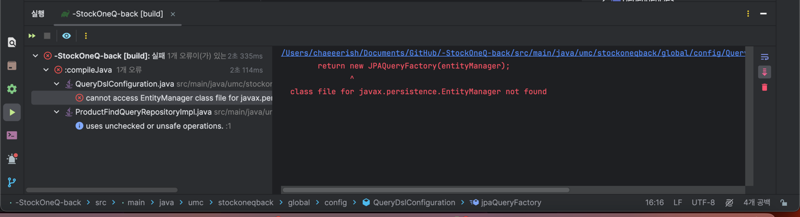  

이것저것 만지다가 jakarta가 빠져있었다. 추가해주었다.
```
implementation 'com.querydsl:querydsl-jpa:5.0.0:jakarta'
```

**마침내,, 성공하였다..** (물론 성공은 아니지만 Q 클래스가 생겼다..)
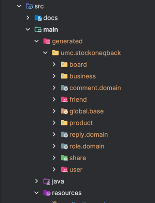

> 그리고, Spring Batch 관련된 코드는 주석처리하였다. 다음 이슈에서...  
> (https://github.com/spring-projects/spring-boot/wiki/Spring-Boot-3.0-Migration-Guide)  

새로운 에러는 다음과 같다.
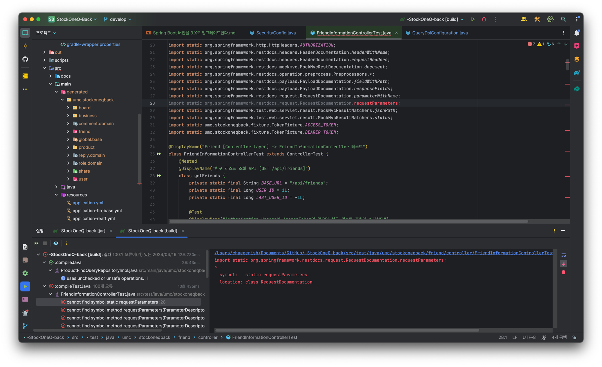

> import static org.springframework.restdocs.request.RequestDocumentation.queryParameters; 
>   => import static org.springframework.restdocs.request.RequestDocumentation.queryParameters;

해결되었다!!  

이제 새로운 에러가 발생하였다.  
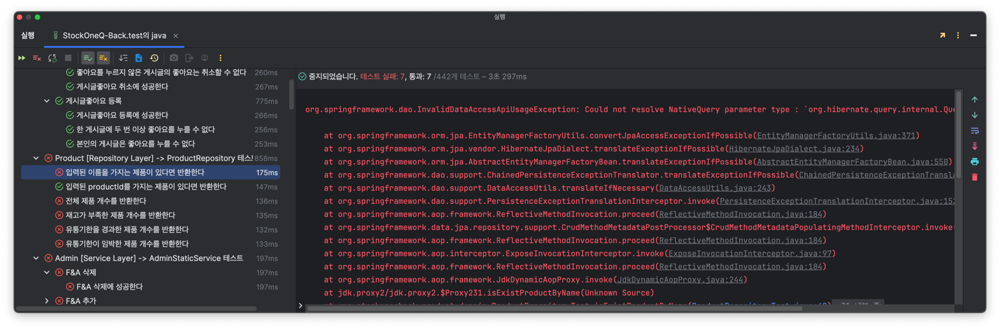  
[스택 오버플로우](https://stackoverflow.com/questions/76522468/could-not-resolve-nativequery-parameter-type-spring-boot-update-version-3)에 따르면 직접 만든 객체를 쿼리에서 사용할 수 없다고 한다.  

ProductRepository.java
```java
    @Query("SELECT p FROM Product p WHERE p.status = '정상' AND p.store = :store " +
            "AND p.storeCondition = :storeCondition AND p.name = :name")
    Optional<Product> isExistProductByName(@Param("store") Store store,
                                           @Param("storeCondition") StoreCondition storeCondition,
                                           @Param("name") String productName);
```

위와 같이 JPQL로 수정하니 해결되었다..
- native query
  - 네이티브 SQL 쿼리
  - 직접 SQL을 작성하여 데이터베이스에 쿼리
  - 따라서, :storeCondition 파라미터는 문자열로 처리된다. 
- JPQL
  - 엔티티와 필드를 대상으로 쿼리를 작성
  - 만약, storeCondition이 문자열이 아니라 열거형 또는 해당 엔터티의 필드라면 JPQL을 사용하는 것이 더 적합하다.

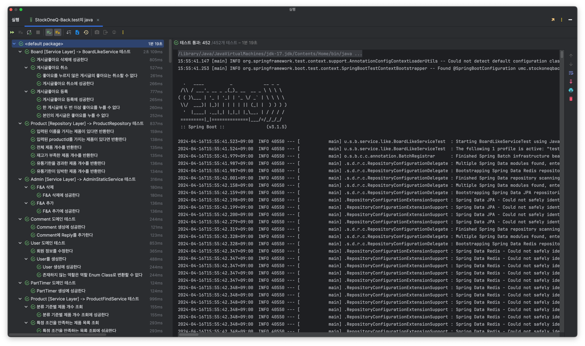
모든 테스트가 통과되었다...